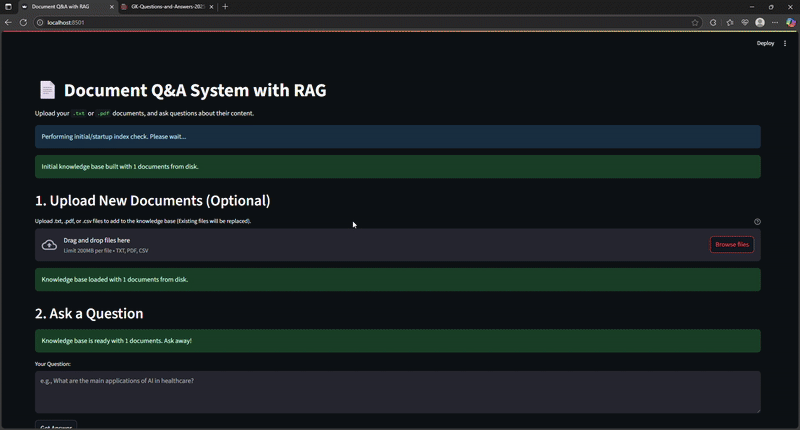

# 📄 Document Q&A System with RAG (Retrieval Augmented Generation)

This project implements a flexible Question-Answering (Q&A) system using the Retrieval Augmented Generation (RAG) architecture. It leverages Streamlit for an interactive user interface, allowing users to upload their own `.txt`, `.pdf`, and `.csv` documents, build a knowledge base from them, and then ask questions.

The system uses Sentence Transformers for embedding, FAISS for efficient similarity search (retrieval), and a Hugging Face Transformers pipeline for generating answers based on the retrieved context.

### 📽 Demo



## ✨ Features

* **File Uploads**: Supports `.txt`, `.pdf`, and `.csv` document uploads.
* **Dynamic Knowledge Base**: Build or rebuild the knowledge base on the fly with uploaded documents.
* **Efficient Retrieval**: Uses FAISS for fast similarity search to find relevant document chunks.
* **Contextual Question Answering**: Generates answers using a powerful Hugging Face QA model based on the retrieved context.
* **User-Friendly UI**: Powered by Streamlit for easy interaction.
* **Containerized Deployment**: Ready for deployment using Docker.

## 🚀 Getting Started

Follow these instructions to set up and run the application.

### Prerequisites

* Python 3.9+ (Python 3.9 is recommended for Docker compatibility with current type hints)
* `pip` (Python package installer)
* `git` (for cloning the repository)
* `docker` (optional, for containerized deployment)

### Local Setup (Without Docker)

1.  **Clone the repository:**
    ```bash
    git clone [https://github.com/YOUR_USERNAME/YOUR_REPOSITORY_NAME.git](https://github.com/YOUR_USERNAME/YOUR_REPOSITORY_NAME.git)
    cd YOUR_REPOSITORY_NAME
    ```
    (Replace `YOUR_USERNAME` and `YOUR_REPOSITORY_NAME` with your actual GitHub details)

2.  **Create a virtual environment (recommended):**
    ```bash
    python -m venv venv
    source venv/bin/activate  # On Windows: venv\Scripts\activate
    ```

3.  **Install dependencies:**
    ```bash
    pip install -r requirements.txt
    ```

4.  **Run the Streamlit application:**
    ```bash
    streamlit run ui/app.py
    ```
    This will open the application in your web browser, usually at `http://localhost:8501`.

### Dockerized Setup (Recommended for Production/Deployment)

1.  **Ensure Docker is installed and running** on your system.

2.  **Clone the repository:**
    ```bash
    git clone [https://github.com/YOUR_USERNAME/YOUR_REPOSITORY_NAME.git](https://github.com/YOUR_USERNAME/YOUR_REPOSITORY_NAME.git)
    cd YOUR_REPOSITORY_NAME
    ```

3.  **Build the Docker image:**
    This command will build the image based on the `Dockerfile` in the root directory.
    ```bash
    docker build -t rag-qa-app .
    ```

4.  **Run the Docker container:**
    This maps port 8501 from your host to port 8501 inside the container.
    ```bash
    docker run -p 8501:8501 rag-qa-app
    ```
    The application will now be accessible in your web browser at `http://localhost:8501`.

## 💡 How to Use the Application

1.  **Upload Documents:**
    * In the Streamlit UI, navigate to the "1. Upload New Documents" section.
    * Drag and drop your `.txt`, `.pdf`, or `.csv` files into the designated area, or click to browse.
    * **Important:** After selecting your files, click the **"Process & Rebuild Knowledge Base"** button. This action will clear any previously indexed documents, save the new files to the `documents/` directory within the application, and rebuild the FAISS index. You'll see success messages once complete.

2.  **Ask a Question:**
    * Once the knowledge base is built (indicated by a success message and enabled Q&A section), proceed to the "2. Ask a Question" section.
    * Type your question related to the content of your uploaded documents in the text area.
    * Click the **"Get Answer"** button.
    * The system will retrieve relevant information from your documents and provide a concise answer, along with the context it used and a confidence score.

## 📁 Project Structure


